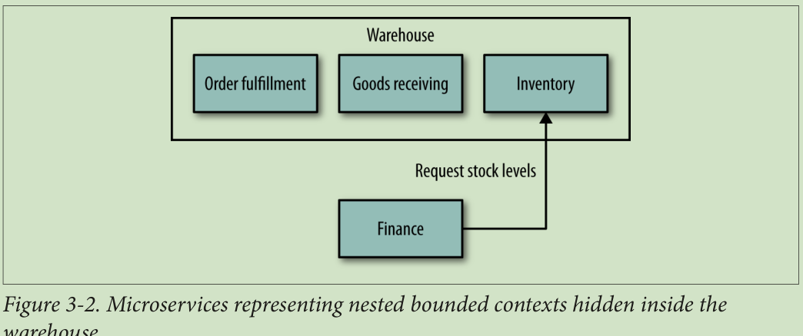
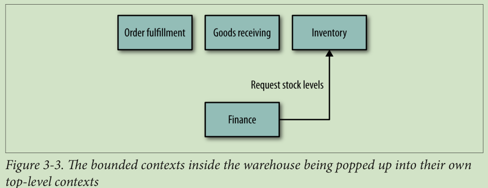
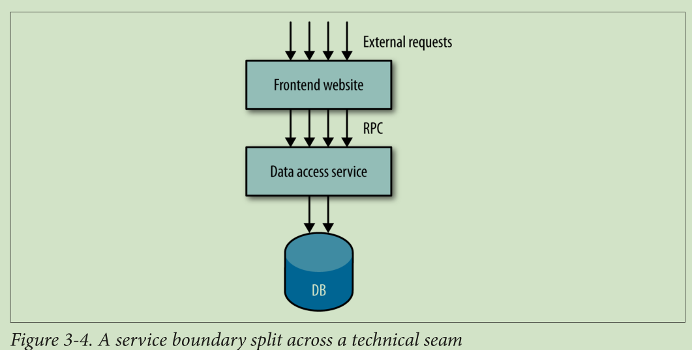

## 前言
	作者 Sam Newman
## 1.微服务介绍
	Microservices
	
### 微服务优势

	* 技术异构：各微服务可以使用不同的技术来实现
		将在第二、四章讨论
	* 易伸缩
		将在第十一章讨论
	* 为各微服务分配不同的资源，以更大的利用现有资源
	* 易部署：更改某一个服务后，只需发布这一个服务
		将在第六章讨论
	* 开发团队组织更灵活
		将在第十章讨论
	* 可复用：微服务可以被桌面端、网页端、移动端、可穿戴设备调用
		将在第五章讨论
	* 易升级与替换
	
### 讨论下面向服务构架（SOA）
	SOA能解决单体应用中的一些痛点，但是其致命的缺点如下：
	
	* 即使花大量时间已未免会真正明白SOA的意义
	* 之间通讯协议复杂
	* 中间件太多
	* 不易拆分业务
	
### 再讨论下其它类似技术
	* 共享库技术
	* 模块化技术

### 微服务也不是银弹，面临的挑战
	* 分布式部署很复杂
	* 监控、测试很复杂
	* 如何架构才能保证系统的可伸缩性
	* 分布式事务处理
	* CAP定理困扰
	> CAP定理，指的是在一个分布式系统中， Consistency（一致性）、 Availability（可用性）、Partition tolerance（分区容错性），三者不可得兼
		
## 2.架构师的扮演的角色及承担的工作
	The Evolutionary Architect

### 不正确的比较
	* 因为其它领域的架构师的经验更易积累，所以跟其它领域的架构师比较，要成为一名合格的架构师或工程师更难；
	* 为了获得社会的承认，我们借用了架构师这个称呼；但是在软件一次又一次的崩溃中，让我们名声变差；
	* 我们自己要重新定义这个角色

### 软件架构师应该的样子
> 做针对实际情况不断的对自己系统进行调整
> 我们的工作更像乡镇规划师：关注布局，而非细节

### 微服务架构师应该关注什么
* 微服务的边界，服务拆分，服务间的关系是怎样的
* 确定服务间的通讯协议
* 统一数据存储标准：使用哪些数据库

### 设计流程
确定目标->确定原则->具体措施
拿一个我们客户的例子来演示：
确定目标：
	* 能支撑高并发业务
	* 能加入新实例
	* 能更新实例
确定原则：
…………
	
### 必备标准
* 监控：
	为了确定各服务的健康状态，有两种方式收集状态：1、服务主动上报；2、主动去各服务收集；无论采用哪种，都要确保传递的数据是标准化的；
* 接口：
	确定各接口要用到的“数字”标准：用于分页、版本等；不要每个接口自己搞一套数字标准；
* 安全：
	
### 代码管理
	进行代码管理，保证代码风格最好的方式是提供示例与模板；
	* 示例比文档更有用

### 技术债
	有两方便的原因：
	* 由于时间原因，我们经常会偷懒处理有的逻辑
	* 各系统的版本没有统一更新
从长远角度来看，我们迟早会为此付出代价；所以架构师要作一个平衡；

### 灵活处理
	* 虽然确定了原则，但还是针对实际情况处理；如果变动的多，那就需要更改原则
	* 要给每个开发微服务的团队充分自由
	
### Governance and Leading from the Center

### 团队建设
	* leader 不仅仅要关闭团队的技术成长，还要帮助团队成员更好的了解自己的个性、更好的塑造自己个性与思想
	* 如何帮助团队成长不是本书讨论的重点，但有一点可以肯定，相比作单体系统开发，微服务团队成员能够获得的东西更少
	* 所以，最好能成员全权负责一个服务的开发 

### 架构师总结
	* 确定系统的技术愿景
	* 明确自己的确定对技术团队与客户的影响
	* 能促使团队全力合作
	* 面对突发情况，灵活处理，及时调整策略
	* 在统筹安排与成员自主之间作好平衡
	* 
	
## 3.为每个服务建模
	How to Model Services
> 本章讲解如何定义各个服务的边界
### 介绍MusicCorp
	结合例子可以更好的阐述概念
	> MusicCorp：是一个音乐公司
	> 这个例子没看懂
	
### 如何构建一个好的微服务
	尽管微服务有很多其它原则，但这里提到的两个是基础
	* 低耦合
		> 方便随时切换，这是微服务根本
		当一个服务变动后，也需要调用它的接口也作更改，这就是典型的高耦合;我们将在第四章中详细讨论
		>严格限定各服务间的通讯标准，就是为了降低耦合
		
	* 高聚合
		相关的逻辑处理放到一起，当改动了一个微服务的某个逻辑后，最好只改动最少的地方；也只更新一个服务；不要一个服务改动了，还要同时改动其它微服务。
		
	基于以上两点，所以我们需要确定服务边界。
		
### 微服务边界的概念
> 感觉没有讲到点子上
	* 作者很喜欢(领域驱动设计)Domain-Driven Design中关于边界的定义；
	* 边界清晰了，功能划分才能清晰
	
#### 每个微服务该提供哪些接口，该暴露什么东西
	上面提到的MusicCorp这个例子中，财务部就不用了解仓储部内部的细节
	* 微服务内部不同的模块提供不同的功能
#### 将微服务内部划分成各个模块
	没有理解boundaries context 这个词，导致对本章节的理解不透
	* 当想清楚每个模块应该提供什么接口时，我们就避免高偶合的这个圬
	* 当您成为一个微服务的技术专家的时候，才可以跳过划分微服务内部模块这个步骤，而直接去切分服务

#### 过早的上微服务
	以我在ThoughtWorks工作时遇到的例子来说。
	我们团队之前开发过一个基于微服务的系统叫Go-CD；后来需要开发另一个领域的新系统SnapCI，于是我们借鉴了之前的经验对其进行服务边界界定，快速的完成了SnapCI的微服务的开发。
	几个月后，我们意识到当初那样划分服务的错误，因为这导致了我们经常要大批量的修改各微服务。最后，我们团队决定将微服务系统融合成单体系统，以便我们能更好的明白各个业务边界。
	一年后，在我们对业务及服务边界很熟悉后，我们团队又将这个单体系统变成微服务系统。
	过早的上微服务是有风险的，特别当您对业务不熟悉的时候。所以将一个单体系统转化成微服务，比直接上微服务要容易的多。

### 业务功能
	我们在划分业务边界的时候，应该从模块的能提供什么样的功能这个方面来思考，而不是从模块需要什么数据来这个方面思考。
	举个例子：仓储业务功能是提供仓储物品清单，而财务业务功能是月末时提供对帐清单或为新入职同事作工资表。从业务功能出发思考需要什么数据。
	所以在为每个服务建模的时候，先想清楚：业务功能是什么，再说 需要什么数据
	
### 海龟背地球原则(Turtles All the Way Down )
	海龟背地球，海龟下面是什么呢？是由另一只海龟背着，如此反复；那么此原则对于切分业务有何影响呢？
	* 划分业务时，粒度先粗点，再细分
	* 举个例子：确定了仓储业务后，再把仓储业务划分为订单处理业务、库存管理业务、货物接收业务。
	* 针对这种嵌套的业务切分，有两种方式：一是把各子业务隐藏于仓储服务中，如图**3-2**，二是将各子业务划分为独立的服务，如图**3-3**
	* 至于应该选择哪种切分方式，没有必需要准则，但是可以视开发团队组织情况而定：如果子业务都是同一个团队开发，那么采取第一种方式；如果是单独开发，那么采取第二种方式；关于团队组织我们将在第十章讨论
	* 但是第一种切分方式更加体系化，从而方便测试。关于测试我们将在第七章讨论	
	

### 业务概念的沟通 
	
	
### 技术边界
	有的团队切分系统时，并没有选择一个垂直的、以业务为中心的切片，而是选择了一个流程API，并做出了一个水平的切片。
	举个例子：之前有一个项目，是帮助加利福尼亚一个客户，这个单体应用已经非常庞大了；这个项目前端和后端分离，通过RPC通信；如图**3-4**；这是一种很脆弱的架构。我称呼这种架构为“洋葱”构架，因为分为很多层；当我们开始准备切分业务和重构时，才发现无从下手。
	
	我不推荐以技术来切分一个系统。
	
	
### 总结
	本章节介绍了什么是一个好的微服务模型，如何保持低偶合与高聚合；理解 Bounded contexts有助于界定服务边界；还介绍了如何细化微服务。我推荐Eric Evans的 《Domain-Driven Design》书很有利我们确定微服务边界，而 Vaughn Vernon的书《Implementing Domain-Driven Design》，提供了很多的实操的方法。
	
## 4.集成
	integration
	如何各众多微服务整合起来
	在我看来，整合也是使用微服务中一个重要环节；做好了，就能让微服务自动、独立部署；做不好，寻就等着灾难降临吧。
	本章介绍了如何避免常见的坑。
	
### 寻找理想的集成技术
	微服务间采用何种协议通信是一个让人头疼的问题；SOAP? XML-RPC? REST? Protocol buffers? 在开始探讨前，我们一定要想清楚刨除技术因素，我们真正想要是什么。
### 避免突发变化

### 保持你的api与技术无关的

### 保持调用者容易使用

### 隐藏的内部实现细节

### 客服的对接管理服务

### 共享数据库

### 异步与同步 

### 编制与编排

### RPC

#### 技术偶合

#### 本地调用不像远程调用 

#### 脆弱性

#### RPC可怕吗?

### REST
#### REST and HTTP
#### 超媒体作为应用程序状态的引擎
#### JSON，XML，还是别的什么?
#### 不要贪太多便宜
#### HTTP REST的缺点

### 实现基于事件的异步协作

#### 技术选择
#### 异步架构的复杂性

###	Services as State Machines

### 响应式扩展

### 在微服务领域中，代码重用和代码重用的危险

#### 客户端库

### 通过引用访问

### 版本控制
#### 尽量拖延时间
#### Catch Breaking Changes Early
#### 使用语义版本控制
#### 不同的端点共存
#### 促进使用多重竞争者版本

### 用户接口
#### 数字
#### 约束
#### API组成
#### UI Fragment Composition
#### 后端,前端
#### 混合方式

### 与第三方软件集成
#### 缺乏控制
#### 定制
#### Integration Spaghetti
#### 根据你自己的条件
#### 扼杀者模式

### 总结

## 5.切分与改造单体应用
	Splitting the Monolith
> 本章介绍了如何将一个复杂的单体应用进行微服务改造

## 6.发布

## 7.测试

## 8.监控

## 9.安全

## 10.康威定律与系统设计
	Conway’s Law and System Design
	
## 11.如何大规模部署微服务
	Microservices at Scale
	
## 12.总结
