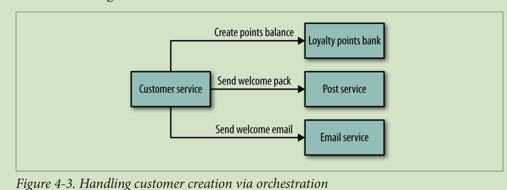
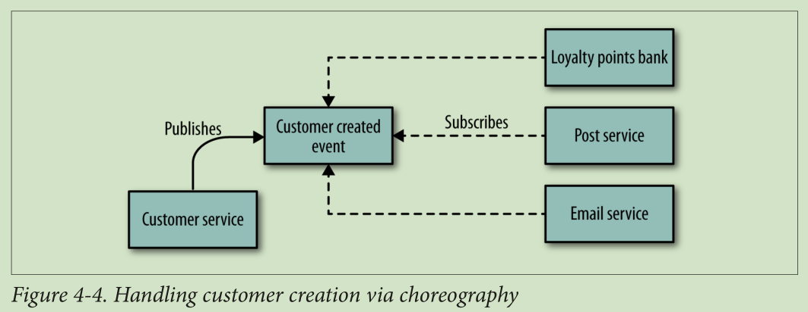

## 前言
	作者 Sam Newman
## 1.微服务介绍
	Microservices
	
### 微服务优势

	* 技术异构：各微服务可以使用不同的技术来实现
		将在第二、四章讨论
	* 易伸缩
		将在第十一章讨论
	* 为各微服务分配不同的资源，以更大的利用现有资源
	* 易部署：更改某一个服务后，只需发布这一个服务
		将在第六章讨论
	* 开发团队组织更灵活
		将在第十章讨论
	* 可复用：微服务可以被桌面端、网页端、移动端、可穿戴设备调用
		将在第五章讨论
	* 易升级与替换
	
### 讨论下面向服务构架（SOA）
	SOA能解决单体应用中的一些痛点，但是其致命的缺点如下：
	
	* 即使花大量时间已未免会真正明白SOA的意义
	* 之间通讯协议复杂
	* 中间件太多
	* 不易拆分业务
	
### 再讨论下其它类似技术
	* 共享库技术
	* 模块化技术

### 微服务也不是银弹，面临的挑战
	* 分布式部署很复杂
	* 监控、测试很复杂
	* 如何架构才能保证系统的可伸缩性
	* 分布式事务处理
	* CAP定理困扰
	> CAP定理，指的是在一个分布式系统中， Consistency（一致性）、 Availability（可用性）、Partition tolerance（分区容错性），三者不可得兼
		
## 2.架构师的扮演的角色及承担的工作
	The Evolutionary Architect

### 不正确的比较
	* 因为其它领域的架构师的经验更易积累，所以跟其它领域的架构师比较，要成为一名合格的架构师或工程师更难；
	* 为了获得社会的承认，我们借用了架构师这个称呼；但是在软件一次又一次的崩溃中，让我们名声变差；
	* 我们自己要重新定义这个角色

### 软件架构师应该的样子
> 做针对实际情况不断的对自己系统进行调整
> 我们的工作更像乡镇规划师：关注布局，而非细节

### 微服务架构师应该关注什么
* 微服务的边界，服务拆分，服务间的关系是怎样的
* 确定服务间的通讯协议
* 统一数据存储标准：使用哪些数据库

### 设计流程
确定目标->确定原则->具体措施
拿一个我们客户的例子来演示：
确定目标：
	* 能支撑高并发业务
	* 能加入新实例
	* 能更新实例
确定原则：
…………
	
### 必备标准
* 监控：
	为了确定各服务的健康状态，有两种方式收集状态：1、服务主动上报；2、主动去各服务收集；无论采用哪种，都要确保传递的数据是标准化的；
* 接口：
	确定各接口要用到的“数字”标准：用于分页、版本等；不要每个接口自己搞一套数字标准；
* 安全：
	
### 代码管理
	进行代码管理，保证代码风格最好的方式是提供示例与模板；
	* 示例比文档更有用

### 技术债
	有两方便的原因：
	* 由于时间原因，我们经常会偷懒处理有的逻辑
	* 各系统的版本没有统一更新
从长远角度来看，我们迟早会为此付出代价；所以架构师要作一个平衡；

### 灵活处理
	* 虽然确定了原则，但还是针对实际情况处理；如果变动的多，那就需要更改原则
	* 要给每个开发微服务的团队充分自由
	
### Governance and Leading from the Center

### 团队建设
	* leader 不仅仅要关闭团队的技术成长，还要帮助团队成员更好的了解自己的个性、更好的塑造自己个性与思想
	* 如何帮助团队成长不是本书讨论的重点，但有一点可以肯定，相比作单体系统开发，微服务团队成员能够获得的东西更少
	* 所以，最好能成员全权负责一个服务的开发 

### 架构师总结
	* 确定系统的技术愿景
	* 明确自己的确定对技术团队与客户的影响
	* 能促使团队全力合作
	* 面对突发情况，灵活处理，及时调整策略
	* 在统筹安排与成员自主之间作好平衡
	* 
	
## 3.为每个服务建模
	How to Model Services
> 本章讲解如何定义各个服务的边界
### 介绍MusicCorp
	结合例子可以更好的阐述概念
	> MusicCorp：是一个音乐公司
	> 这个例子没看懂
	
### 如何构建一个好的微服务
	尽管微服务有很多其它原则，但这里提到的两个是基础
	* 低耦合
		> 方便随时切换，这是微服务根本
		当一个服务变动后，也需要调用它的接口也作更改，这就是典型的高耦合;我们将在第四章中详细讨论
		>严格限定各服务间的通讯标准，就是为了降低耦合
		
	* 高聚合
		相关的逻辑处理放到一起，当改动了一个微服务的某个逻辑后，最好只改动最少的地方；也只更新一个服务；不要一个服务改动了，还要同时改动其它微服务。
		
	基于以上两点，所以我们需要确定服务边界。
		
### 微服务边界的概念
> 感觉没有讲到点子上
	* 作者很喜欢(领域驱动设计)Domain-Driven Design中关于边界的定义；
	* 边界清晰了，功能划分才能清晰
	
#### 每个微服务该提供哪些接口，该暴露什么东西
	上面提到的MusicCorp这个例子中，财务部就不用了解仓储部内部的细节
	* 微服务内部不同的模块提供不同的功能
#### 将微服务内部划分成各个模块
	没有理解boundaries context 这个词，导致对本章节的理解不透
	* 当想清楚每个模块应该提供什么接口时，我们就避免高偶合的这个圬
	* 当您成为一个微服务的技术专家的时候，才可以跳过划分微服务内部模块这个步骤，而直接去切分服务

#### 过早的上微服务
	以我在ThoughtWorks工作时遇到的例子来说。
	我们团队之前开发过一个基于微服务的系统叫Go-CD；
	后来需要开发另一个领域的新系统SnapCI，于是我们借鉴了之前的经验对其进行服务边界界定，快速的完成了SnapCI的微服务的开发。
	
	>几个月后，我们意识到当初那样划分服务的错误，因为这导致了我们经常要大批量的修改各微服务。
	>最后，我们团队决定将微服务系统融合成单体系统，以便我们能更好的明白各个业务边界。
	>一年后，在我们对业务及服务边界很熟悉后，我们团队又将这个单体系统变成微服务系统。
	>
	过早的上微服务是有风险的，特别当您对业务不熟悉的时候。所以将一个单体系统转化成微服务，比直接上微服务要容易的多。

### 业务功能
	我们在划分业务边界的时候，应该从模块的能提供什么样的功能这个方面来思考，而不是从模块需要什么数据来这个方面思考。
	举个例子：仓储业务功能是提供仓储物品清单，而财务业务功能是月末时提供对帐清单或为新入职同事作工资表。
	从业务功能出发思考需要什么数据。
	所以在为每个服务建模的时候，先想清楚：业务功能是什么，再思考需要什么数据
	
### 海龟背地球原则(Turtles All the Way Down )
	海龟背地球，海龟下面是什么呢？是由另一只海龟背着，如此反复；那么此原则对于切分业务有何影响呢？
	* 划分业务时，粒度先粗点，再细分
	* 举个例子：确定了仓储业务后，再把仓储业务划分为订单处理业务、库存管理业务、货物接收业务。
	* 针对这种嵌套的业务切分，有两种方式：一是把各子业务隐藏于仓储服务中，
	> 如图**3-2**，二是将各子业务划分为独立的服务，如图**3-3**
	* 至于应该选择哪种切分方式，没有一定要遵守准则，但是可以视开发团队组织情况而定：
	如果子业务都是同一个团队开发，那么采取第一种方式；如果是单独开发，那么采取第二种方式；关于团队组织我们将在第十章讨论
	* 但是第一种切分方式更加体系化，从而方便测试。关于测试我们将在第七章讨论	
	

### 业务概念的沟通 
	
	
### 技术边界
	有的团队切分系统时，并没有选择一个垂直的、以业务为中心的切片，而是选择了一个流程API，并做出了一个水平的切片。
	举个例子：之前有一个项目，是帮助加利福尼亚一个客户，这个单体应用已经非常庞大了；这个项目前端和后端分离，通过RPC通信；
	
	如图**3-4**；
	
	这是一种很脆弱的架构。我称呼这种架构为“洋葱”构架，因为分为很多层；当我们开始准备切分业务和重构时，才发现无从下手。
	
	我不推荐以技术来切分一个系统。
	
	
### 总结
	本章节介绍了什么是一个好的微服务模型，如何保持低偶合与高聚合；理解 Bounded contexts有助于界定服务边界；还介绍了如何细化微服务。
	我推荐Eric Evans的 《Domain-Driven Design》书很有利我们确定微服务边界，而 Vaughn Vernon的书《Implementing Domain-Driven Design》，提供了很多的实操的方法。
	
## 4.集成
	integration
	如何各众多微服务整合起来
	在我看来，整合也是使用微服务中一个重要环节；做好了，就能让微服务自动、独立部署；做不好，寻就等着灾难降临吧。
	本章介绍了如何避免常见的坑。
	
### 寻找理想的集成技术
	微服务间采用何种协议通信是一个让人头疼的问题；
	SOAP? XML-RPC? REST? Protocol buffers? 
	在开始探讨前，我们一定要想清楚再刨除技术因素外，我们真正想要的是什么。
	
要从以下四个个方面思考：

#### 1.技术的变化不能影响已有服务正常使用
		比如，一个微服务的接口的字段变化了，就导致其它服务就不能正常使用了
		不能我们一修改接口，就要求其它人也修改他们的接口；
		
#### 2.保持你的api是与技术无关的
	   因为IT技术日新月异，随时可能升级或换架构；
	   再加上，微服务本身是一种开发的架构；
	   所以，不要API跟特定的技术捆绑
	   
#### 3.保证易用性
		保证其它系统能很容易的使用我们的提供的服务；
		否则，会让微服务的价值大打折扣；
		提供一个SDK，能方便用户使用；
		但这却增加了系统的偶合度；

#### 4.隐藏内部实现细节
		对于调用者，我们系统是透明的；
		不要我们一修改系统，就要求 调用者修改；
		因为，这会增加以后我们升级和改造系统成本，
		从而让我们背上技术债；

### 客服的对接管理服务
		在了解应该使用什么样的技术后，让我们继续看MusicCorp这个实例；
		当MusicCorp新增一个客户时，有很多关联操作，如建立财务账号、发送欢迎邮件；
		当删除一个客户时，也会有相关的操作执行；
		
所以接下来，我们看看不同微服务如何同步数据

### 共享数据库
	到目前为止，通过数据库来整合各个服务还是很普遍的；
	很多业务，都是对同一个数据库的增删改查；
	这就导致了几个严重的问题：
	1、数据表结构对外都是公开的；且每个人都不敢轻易更改表结构，怕影响其它人的使用；如果要修改，则进行大量的回归测试；
	2、刚开始大家都是使用的关系型数据库，可后来有的客户想转用非关系数据库；因为大家都是使用的同一库，所以根本就不能转移；
		这就违背了低偶合的原则；
	3、当有多个逻辑都会用到数据时，如果修改了数据库，那么相关的逻辑也要修改；这就违背了高聚合的原则；

使用数据库来共享数据，就严重违背了微服务最重要的两个原则低偶合和高聚合的原则；

接下来，我们将讨论其它的共享数据与通信的方式	
	
### 异步与同步 
	确定各微服务间采用同步还是异步通信也很重要；
	有两种通信模式：
	请求/响应：这种模式一般用同步通信；如果 用异步，一般是先注册一个回调函数；
	基于事件：也就是发布/订阅；双方都不管对方的处理结果，异步操作
至于我们应该选择哪种模式这取决于不同服务对处理结果的依赖程度

### 中心化与去中心化
	Orchestration Versus Choreography
	我们在完成一个业务逻辑的时候，可能会同时操作好几个微服务；
	一般有两种模式：
	中心化（Orchestration）：相当有一个中央服务，来调度各个服务，并掌握节奏从而来完成业务逻辑；
	类似于乐队中有一个指挥；
	与去中心化：各个微服务比较智能，发布/订阅业务处理的进度，从而完成业务逻辑；
	类似于芭蕾舞中每个成员会协同，达到步调一致；
	
我们接着看 MusicCorp 这个例子：
	新增一个用户，我们要在银行里创建记录，也要发送欢迎信息；
	中心化：如图 4-3
	去中心化：如图 4-4
	
	>中心化模式：
	一般基于request/response同步请求
	缺点是看起来像是一个“上帝”服务在指挥一群只会“CRUD”的服务在干活；
	优点是能我们能精确知道整个流程的进展情况；
	
	>去中心化模式：
	一般基于事件驱动，异步请求；
	缺点是需要额外的服务来监控整个流程，每个服务是否执行成功；

	我推荐采用去中心化模式，低偶合，更灵活；当然我们可以组合使用，以最合适的的方式解决问题；

	

	
	
接下来，我们来看基于请求/响应模式的两种具体实现：RPC 和 REST
### RPC
	RPC 使用的协议有很多：
	SOAP, Thrift, protocol buffers,Java RMI
	有的基于TCP（稳定），有的基于UDP（开销小）
	优点：易用，速度快

RPC的缺点也很显，如下所示：	
	
#### 1、技术偶合
	比如 java RMI 要求是java 平台
	有的RPC限制了互相操作

#### 2、习惯性的把远程调用当本地调用
	RPC的核心是远程调用的透明化，
	有时太像本地调用，一不小心就会大量使用RPC调用，而忽略了网络传输和编解码所要的时间；
	再加上，网络本身是不可靠的；
	所以出了问题，很难排查；
	
#### 脆弱性
	拿Java RMI举例:
	1、当RPC远程方法重载一个方法后，无论客户端用没用，都要更新自己代码；
	2、当RPC远程代码去除一个不用的属性时，为了兼容老版本，那么还得部署两个版本的代码；
	
#### RPC可怕吗?
	虽然缺点多，但我还是会用RPC；有一些改进方案；
	比如  protocol buffers和Thrift，会统一建model,客户端与服务端都是用同一套；就不会有差异化的情况；
	但是要做客户端代码与远程代码的平衡，要确保您想升级远程代码时不能因为客户端而受阻；

在请求/响应模式中，相比用数据库作同步，RPC有很大的进步，但接下来我们进一步探讨更好的方式；
	
### REST
	REST的核心是资源
	REST请求，不限于资源的任何形式
	Rest不关心底层协议，一般都基于HTTP；
	除http外，还可以基于USB、串行协议来实现Rest
	
#### REST and HTTP
	HTTP很合适跟REST配合使用，
	GET, POST,PUT请求直接对应着对资源的不同的处理
	围绕HTTP,有大量成熟的各种方案；比如负载、安全、认证
	HTTP 也可以用于实现RPC，但是相应的规范比较少
#### HATEOAS 超链接 超媒体
	使用REST时，可以使用超链接导航资源，这在一定程度上减少了偶合。
	
#### JSON，XML，或别的什么?
	虽然示例中，我都是使用的XML
	但JSON无疑是最受欢迎的；
	Hypertext Application Language (HAL) 协议对JSON进行了补充，弥补JSON对超链接支持的不足
	也可以使用HTML，因为它同时可以提供UI 与API
	我个人很喜欢用XML一些特性：如，XPATH

#### 不要太偷懒
	很多框架都可以直接生成REST接口；但这可能为将来埋下祸根；
	比如直接在数据表模型上进行操作，这会增加偶合；
	还有一更普遍的问题就是什么时候存储我们的数据，和如何给用户提供数据的操作接口；
	框架直接生成的接口不会解决这个问题；
	我们团队的做法是先让各个接口跑通，把数据先存储在本地文件，等都稳定后，我们再来思考分布式持久化存储的事情；
	这样做前提是要遵循服务驱动的设计模式
	这个方案的缺点就是数据库相关的工作会被推迟
	但是对于刚开始上微服务来说，这么做是值得的

#### HTTP REST的缺点
	1、无法为用户提供SDK
	2、并不是所有的服务端都支持HTTP所有的方法
	3、跟Thrift相比，JSON的性能不足；更适用于对延迟要求不高的场景
	4、服务端之间通信不建议使用http rest；很多的RPC框架值得使用
	5、跟RPC相比，http rest 通信双方要对传递的信息序列化与反序列化
	
虽然缺点多，但http rest 仍是首选

### 基于事件的异步通信
	我们之前讨论了基于 request/response 模式的通信
	现在我们讨论下基于事件的异步通信
	
#### 技术选择
	有两个关键点：微服务生产者如何发送事件，消费者如何接收
	传统方式是用 RabbitMQ来解决这两个问题
	也可以使用http 来传输事件；ATOM是一个这方面的规范
	但是使用http缺点就是延迟太高
	如果你还没有一个成熟的方案，ATOM值得一看
	

#### 异步架构的复杂性
	基于事件有显著的优势，但是面临的问题也不少
	比如，一个服务的节点发出事件后，当处理完的结果是需要返回到同个节点上吗？如果需要，那么如果这个节点挂了怎么办？
	如果不需要，那是不是我还需要另外的服务来存储相关信息
	Short-lived async 可以解决以上困扰，但这需要开发者习惯于这种思维
	在这里我们谈谈在06年的时候做过的一个银行项目出过的一个bug，导致我们节点灾难性的故障转移
	事件是这样的：
	我们有个服务监听市场商品的事件，用于随时调整价格；
	我们将事件放入队列；如果一个事件没有被处理完，就会被一直重试，直到处理完；
	当一个bug引起一个节点在处理事件时崩溃后，其它节点会继续处理这个事件；
	这导致我们所有这个服务的所有节点都崩溃了；
	针对这次事件我们认识到，除了本身有bug外；对一个事件处理要有最大重试次数；

###	Services as State Machines

### 响应式扩展

### 在微服务领域中，代码重用和代码重用的危险

#### 客户端库

### 通过引用访问

### 版本控制

#### 尽量拖延时间

#### Catch Breaking Changes Early

#### 使用语义版本控制

#### 不同的端点共存

#### 促进使用多重竞争者版本

### 用户接口
#### 数字
#### 约束
#### API组成
#### UI Fragment Composition
#### 后端,前端
#### 混合方式

### 与第三方软件集成
#### 缺乏控制
#### 定制
#### Integration Spaghetti
#### 根据你自己的条件
#### 扼杀者模式

### 总结

## 5.切分与改造单体应用
	Splitting the Monolith
> 本章介绍了如何将一个复杂的单体应用进行微服务改造

## 6.发布

## 7.测试

## 8.监控

## 9.安全

## 10.康威定律与系统设计
	Conway’s Law and System Design
	
## 11.如何大规模部署微服务
	Microservices at Scale
	
## 12.总结
